Azure Monitor is a quite new addition to the monitoring sphere when talking about monitoring Microsoft technologies. Traditionally it has been System Center Operations Manager (SCOM) that´s been the go-to guy but with the new addition of Azure Monitor some things have changed. From time to tome one can hear the phrase “SCOM is dead” and that you should go all-in with Azure Monitor instead. But is it really that easy?  
In my opinion, no it’s not. While Azure Monitor has a lot of strengths being cloud-based with regularly updates and additions, it still lacks some things that we´re used to from using SCOM for all these years.

I would say it’s a good thing to combine these two tools instead of just picking one over the other, SCOM has its strengths while Azure Monitor has its strengths. Still, a lot of the customers IT environments are on-prem and there is still a need for the deep monitoring that SCOM provides through all its management packs to help the application teams keep track of their applications. While that’s true, a lot of applications are continuously being moved to the cloud with all its opportunities, and of course that raises the question of how to monitor them in their new environment.

In my opinion Azure Monitor is a great monitoring tool for the cloud-based resources, as a web site or just a VM based in Azure since they are all up there and there´s a lot of metrics you can collect from the resources and act on.

One of the most important things when it comes to monitoring is of course the alerting functionality, we still need to know when something goes wrong. Therefore I will show how to get started with Azure Monitor alerting through this post.

## Saving the query for later use

Log on to the Azure portal and navigate to “Monitor”.

_If you haven´t got “Monitor” among your favorites, just click “All services” in the upper left corner of the portal and you will find Monitor through a simple search for the word “Monitor”. A pro tip is to click the yellow star to make it a favorite._

Once you´ve clicked your way into Monitor, click “Logs”.

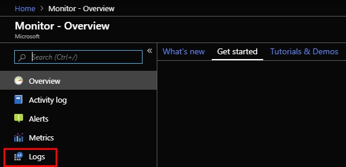

For this example, I will use a query which picks up disk instances where there are less than 10 percent of free space. If you want to change the drive letters to check for, just update the highlighted section in the query.

Paste the below query into the search window:

let \_minValue = 10; Perf | where TimeGenerated >= ago(1h) | where CounterValue <= \_minValue | where CounterName == "% Free Space" and InstanceName in ("C:", "D:", "E:", "F:", "G:", "H:")  | summarize mtgPerf=max(TimeGenerated), CounterValue=max(CounterValue) by Computer, InstanceName, CounterName, ObjectName, DriveLetter=replace(@"(\\w).",@"\\1", InstanceName) | join kind=inner (Heartbeat | where OSType == "Windows"| summarize max(TimeGenerated) by Computer) on Computer  | project Computer, ObjectName, CounterName, InstanceName, TimeGenerated=mtgPerf, round(CounterValue), DriveLetter, AlertType\_s = "Windows Low Disk Space", Severity = 3, SeverityName\_s = "WARNING", AffectedCI\_s = strcat(Computer, "/", DriveLetter), AlertTitle\_s = strcat(Computer, ": Low Disk Space on Drive ", DriveLetter), AlertDetails\_s = strcat("Computer: ", Computer, "\\r\\nDrive Letter: ", DriveLetter, "\\r\\nPercent Free Space: ", round(CounterValue), "%\\r\\nAlert Threshold: <= ", \_minValue, "%")
| distinct Computer, ObjectName, CounterName, InstanceName, TimeGenerated, CounterValue, DriveLetter, AlertType\_s, SeverityName\_s, AffectedCI\_s, AlertTitle\_s, AlertDetails\_s

Click Save.

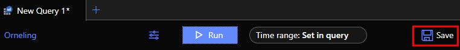

Name the query and choose to save it as a query and then choose what you would like to call the category. Then click Save and the query is ready to be used.

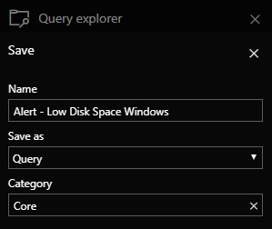

## Creating an action group

To be able to act on alerts, such as sending an email or to trigger a runbook, we need to create an action group. This is where the information of the recipients and webhooks etc. are stored.

Go to “Monitor” from your favorites in the left pane of the Azure Portal and click "Add action group".

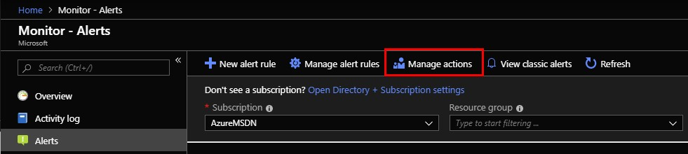

Give the action group a name, and really think through the naming convention to make sure it´s easy to keep track of the action groups later. Also, use the resource group where you´ve created the other resources such as the workspace, in my case the resource group is called AzureMonitor.

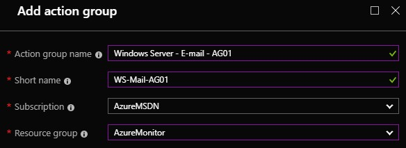

Next, it´s time to create the actions that decide what shall be done when an alert fire. In this case I want to send an email to the Windows server team. Fill in a name of the action, “Email WS Team” for example, and then choose what action type to use from the drop-down. In this case we will be using Email, but as you can see, you can trigger Azure Functions, Webhooks, launch an Azure Automation runbook etc. making it really powerful.

Select Email/SMS/Push/Voice.

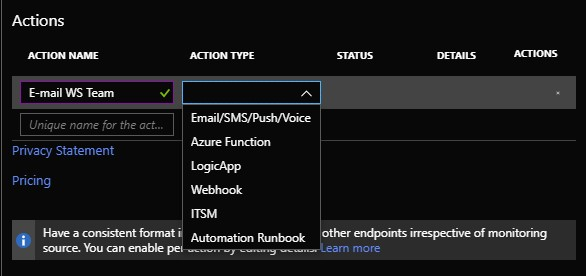

Type in the email address to use and whether you want to send a SMS or receive a phone call and then click OK at the bottom.

Once the action group is created, each user you´ve added using their personal email address will get a confirmation email that they are not included in the action group.

## Creating the alert

The last thing we need to do is to create the alert rule itself, after this is done we can start receiving alerts directly in our mailbox.

Go back to “Monitor” from your favorites in the left pane of the Azure Portal and then click "New alert rule".

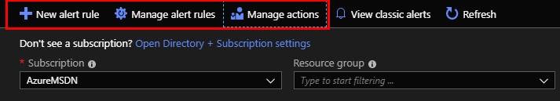

In the “Resource” section, click the Select button.

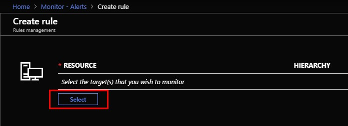

Select your Azure subscription and then select “Log Analytics workspaces” from the drop-down. Then select the workspace you want to query and click Done.

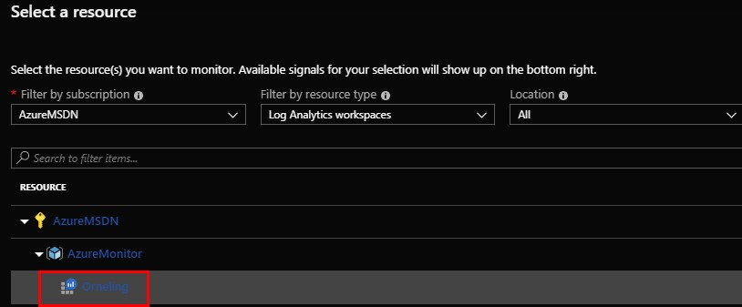

In the “Conditions” section, click Add. Then choose “Log Search” as the Signal type, followed by “Log analytics” as the Monitor service. Now you will be presented with the queries you have saved earlier. Choose the query you just created.

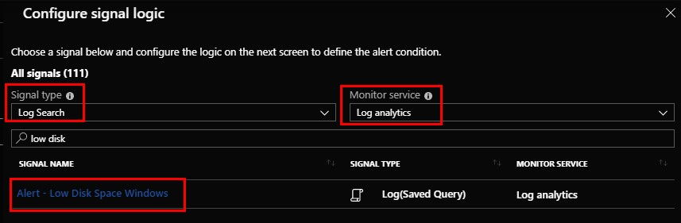

Now you will see the query and hopefully you won´t get any results since we´ve set the minimum value to 10 percent.

The one thing you need to set here is the threshold value. Since we want to know as soon as there is at least one server with low disk space, any threshold value greater than zero will do the trick for us. Hence, set the value to zero and then click Done.

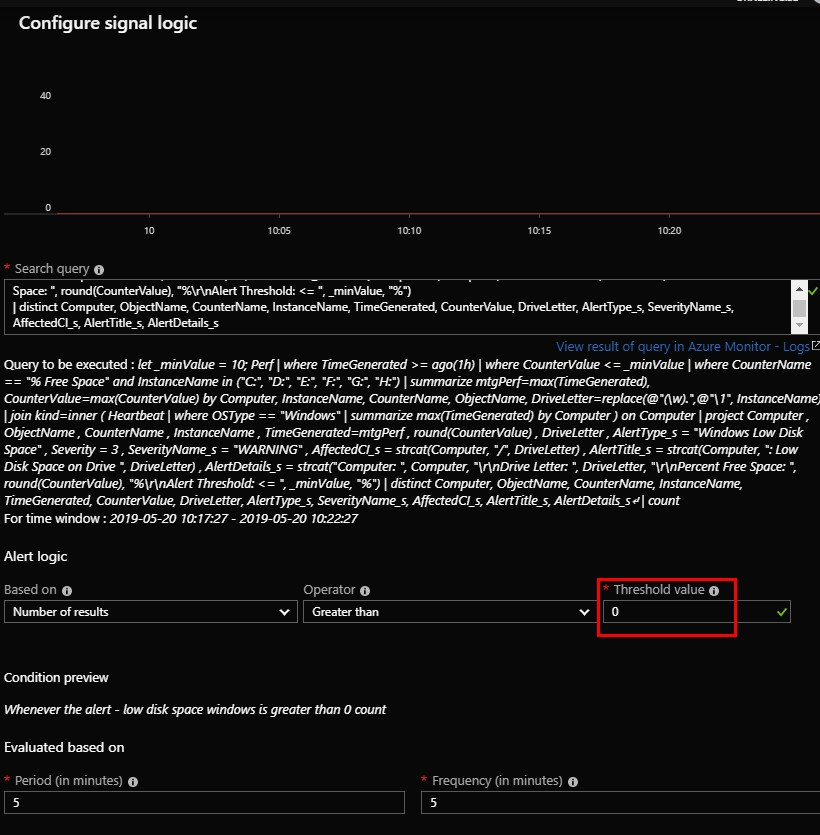

## Creating the Action rule

In the “Actions” section, click “Add” and then choose the action group you created earlier. In this case I´m going with the “Windows Server – E-mail – AG01” action group.

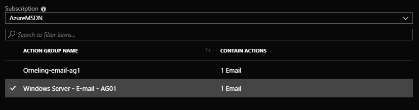

Finally, name the action rule before finishing it off.  Finish by clicking Create at the bottom.

In the “Actions” section, click “View configured actions” to verify all is good. It should look like below.

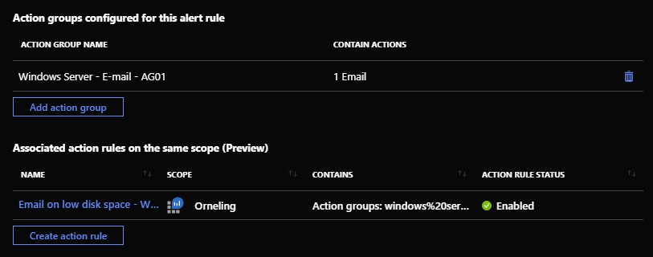

Click Cancel to go back.

Define a name for the alert, choose which severity of the alert you´d like (I´m sticking with a warning for this example), choose whether you want to suppress alerts or not. I´m choosing to suppress the alerts for an hour to be able to be able to take care of the alert before it fires again, obviously this value should be set differently depending on the scenario. Click “Create alert rule” and your good to go.

## Successfully receiving alerts from Azure Monitor

The last thing I´m going to show in this post is what it looks like when you receive an alert. To force an alert in my environment I filled up the disk on one of my servers and almost immediately received the email seen below. The email can be changed a bit to let you customize the subject etc. to better fit your needs.

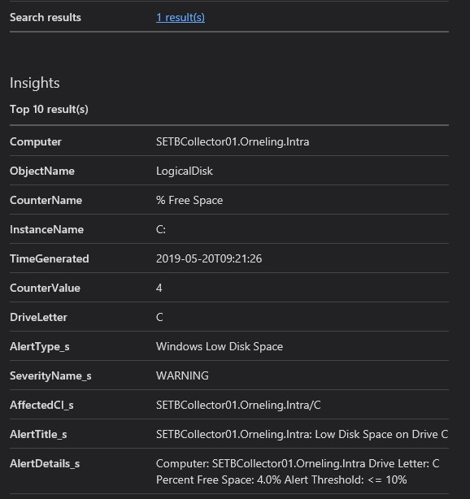

## Summary

This was a walk-through on how to get going with the alerting in Azure Monitor. The first time can feel kind of tricky and as there is a lot of steps, but that´s the first time when you create the action groups for the Windows Server team for example. Creating another query to alert on that should alert the Windows Server team will be easier from here on since the action group is already created, making it more of a next, next experience.

Remember how I just picked out the email option to alert on, meaning there are far more possibilities when it comes to alerting. Even though I didn´t show it in this post, you can always trigger automations to take care of urgent alerts, such as restarting a service or cleaning up disk space etc.

I hope you liked the post, I will keep writing about these kinds of stuff to keep your eyes open for more information. And as always. Any questions? Just leave a comment below and I´ll get back as soon as possible.
